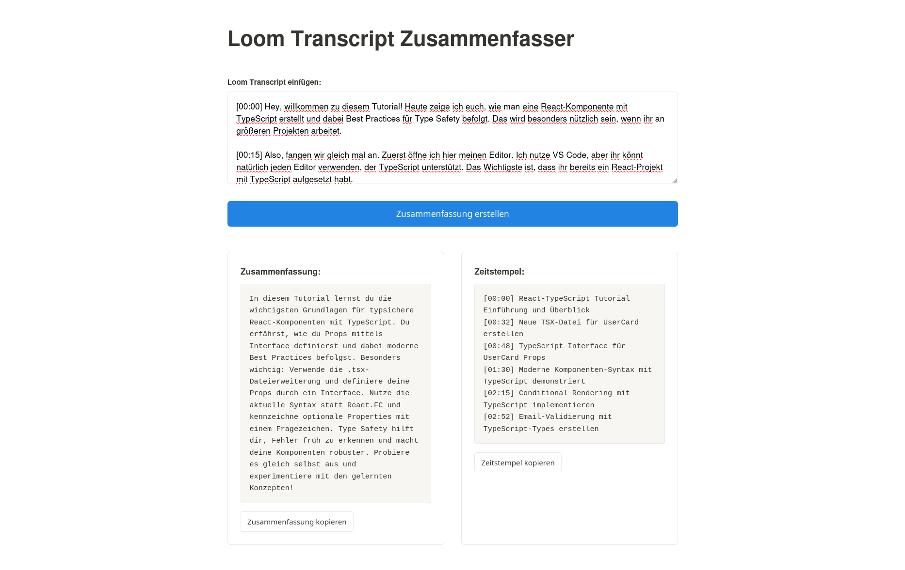

# Loom Transcript Zusammenfasser

Ein leichtgewichtiger Node/Express-Dienst, der Loom- oder Zoom-Transkripte an Anthropic Claude weiterleitet, um eine kompakte Zusammenfassung und sortierte Zeitstempel in deutscher Sprache zu erzeugen. Die App kombiniert einen einfachen Proxy (`server.js`) mit einer statischen HTML/CSS/JS-Oberfläche für schnelle manuelle Workflows.



## Features
- **Anthropic-Proxy**: Sicherer `POST /api/claude`-Endpoint, der die Eingabe-Prompts an Claude Sonnet weitergibt.
- **Frontend in Deutsch**: Klar strukturierte Oberfläche mit separaten Boxen für Zusammenfassung und Zeitstempel inklusive Kopier-Buttons.
- **Konfigurierbare Modelle**: Setze `ANTHROPIC_MODEL`, um zukünftige Claude-Releases anzusprechen.
- **Schnelles Setup**: Keine Build-Pipeline, nur Node.js 18+ und ein API-Key.

## Schnellstart
1. Abhängigkeiten installieren:
   ```bash
   npm install
   ```
2. `.env.example` nach `.env.local` kopieren und `ANTHROPIC_API_KEY` (sowie optional `ANTHROPIC_MODEL`/`PORT`) befüllen.
3. Entwicklungsserver starten:
   ```bash
   npm run dev
   ```
4. Browser öffnen: [http://localhost:3000](http://localhost:3000) und ein Transkript einfügen.

## Manuelle Verifikation
- Testtranskript einfügen, auf **Zusammenfassung erstellen** klicken, anschliessend prüfen, dass beide Ausgabefelder befüllt werden.
- Netzwerkfehler-Szenario: API-Key entfernen oder ungültig setzen; die App sollte eine Fehlermeldung anzeigen, der Server loggt einen verständlichen Hinweis.

## Projektstruktur
- `server.js` – Express-App, `.env`-Handling, Proxy zu Anthropic.
- `index.html`, `script.js`, `style.css` – statische Oberfläche, Fetch-Logik und Styling.
- `AGENTS.md` – Contributor-Guide mit Konventionen.
- `.env.example` – Referenz für Konfiguration.

## Lizenz
Kein Lizenztext hinterlegt. Ergänze eine passende Lizenz, falls das Repository öffentlich geteilt werden soll.
